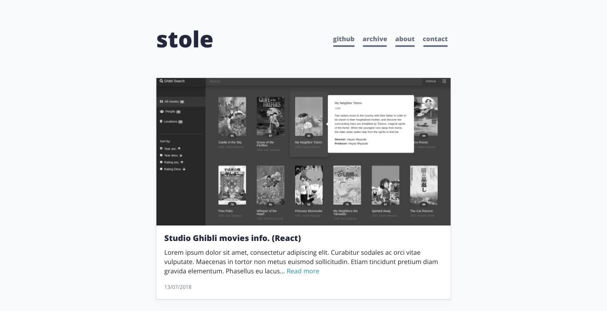

# Personal projects blog

> This website contains some of my personal project, tutorials and snippets. It is hosted on github pages at stoles.github.io. (WIP)



## Instructions

If you want to use this as an template for your project:

```sh
$ git clone https://github.com/stoleS/projects-blog-source.git
$ cd PROJECT
$ npm install
$ bundle exec jekyll serve
```

This will install bootstrap with it's dependencies.

Read the [Jekyll documentation](http://jekyllrb.com/docs/home/) for more details.

### Directory structure

- `_config.yml` : Jekyll [configuration](http://jekyllrb.com/docs/configuration/)
- `_layouts/` - `default.html` : default template
  - `post.html` : post template
- `_includes/` - `header.html`, `footer.html` : header and footer used by the default template
  - `head.html` : site navigation
- `_sass`: SasS stylesheets
- `index.html` : main page
- `about.html` : about page
- `archive.html` : archive page
- `contact.html` : contact page
- `package.json` : npm dependencies

The pages must specify a template (default) and a title, and can be written in [Markdown](http://daringfireball.net/projects/markdown/), HTML or a mixture of these.

## Meta

Predrag Stošić - [stoleS](https://github.com/stoleS) - predragstosic29@gmail.com

## License

This project is licensed under the MIT License - see the [LICENSE.md](https://github.com/stoleS/projects-blog-source/blob/master/LICENSE) file for details.
